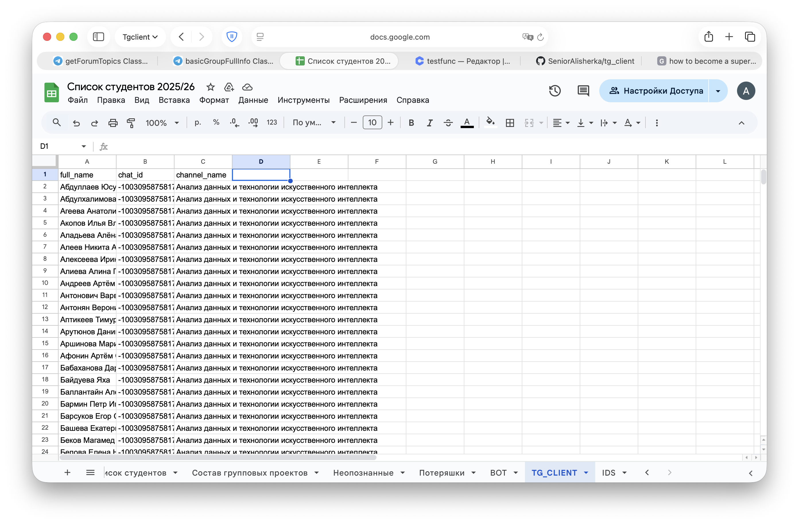
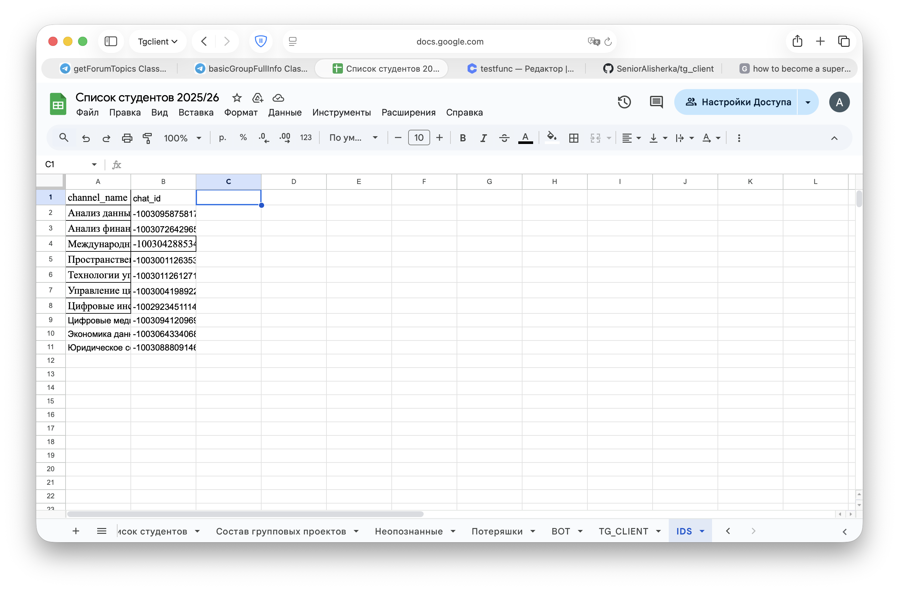

# Что было сделано

## Установка и сборка TDLib

Запустить в терминале, чтобы скачать:
- Xcode Command Line Tools
- Homebrew
- TDLib

Затем он компилирует `libtdjson.dylib` через `CMakeLists.txt`.

```bash
xcode-select --install
/bin/bash -c "$(curl -fsSL https://raw.githubusercontent.com/Homebrew/install/HEAD/install.sh)"
brew install gperf cmake openssl
git clone https://github.com/tdlib/td.git
cd td
rm -rf build
mkdir build
cd build
cmake -DCMAKE_BUILD_TYPE=Release -DOPENSSL_ROOT_DIR=/opt/homebrew/opt/openssl/ -DCMAKE_INSTALL_PREFIX:PATH=../tdlib ..
cmake --build . --target install
cd ..
cd ..
ls -l td/tdlib
```

Дальше:
- Создал venv.
- Создал `.env`.
- Полученные 2 файла (1 основной, другой alias) я засунул в `materials`.
- Сервисную почту Google Sheets засунул credentials в `materials/secrets`.
- Написал свой `tg_client.py`, следуя правилам:
  - Если чего-то много, то создаем новый класс в datatypes.
  - Каждые статические инстансы засовываем в static_instances (функции это тоже статические инстансы класса функция).
  - Если для выполнения функции нужен shared_state в клиенте, то стараемся не засорять клиент и использовать уже использованный state как например pending (он каждый раз сбрасывается и используется заново для новых запросов).
- Создал `requirements.txt`.


## Как добавлять любые классы

1) Менюшки называешь типа `main`.
2) Для каждой менюшки создаешь `button_factory` типа `main`.
3) Кнопки называешь типа `main_1`.
4) Действие кнопки называешь типа `main_1`.
5) `event_handlers` называешь типа `updateAuthorizationState`.
6) `extra_handlers` называешь типа `updateAuthorizationState_main_1`.
7) `extra_handlers_actions` называешь типа `user_main_1`
8) `helper` называешь типа `helper_{whatitdoes}`, например `helper_auth_wait_params`.

## Баги (нерешаемые)

1) Пока вводишь пароль, если нажимаешь Ctrl+C, то `close` отправляется, 
   но ответ не приходит, потому что твой же инпут блокирует `tdlib_loop`.
   Делать его мейн-тредом тупо (+ даже тогда при Ctrl+C он прекратит сам луп).
   (+ даже если снова начать луп чтобы дождаться `close`, может прилететь снова
   `updateAuthorizationState wait for pswd` и снова залочить).
   (+ это тупо очень).
   Выводить инпут в другой тред тоже тупо потому что ты нарушаешь правило,
   update - handler - update - handler - update ...
   Поэтому только так.

## При сборке

1) Чекнуть работу `logs` (db).
2) В `.env` есть полный путь.
3) Терминал пишет `clear`.

## Доп заметки

- По сути `channel_2` это кнопка для информации как работать с долгими
  операциями (через canceler).
- Можно не делать `send_next`, а просто сразу все отправить через for loop.

## Структура данных в Google Sheets



